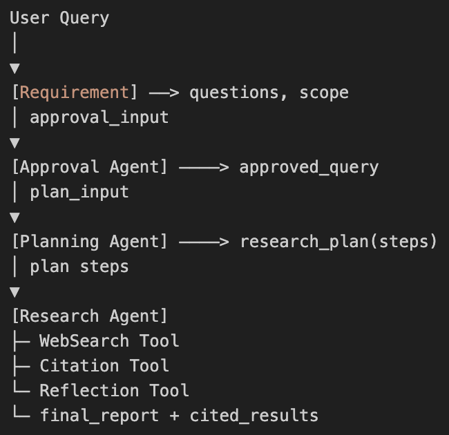

# Deep Search Project

## Description

The **Deep Search Project** is an advanced search automation system designed to assist in gathering, planning, researching, and reflecting on various types of data. The project is structured into four key stages: **Requirement Gathering**, **Approval**, **Planning**, and **Research**. Each stage is handled by dedicated agents that perform their respective tasks, with specialized tools integrated into the **Research** stage for performing web searches, generating citations, and reflecting on the gathered data.

## Table of Contents

1. [Installation](#installation)
2. [Usage](#usage)
3. [Agent Workflow](#agent-workflow)
4. [Tools](#tools)
   - [Web Search Agent](#web-search-agent)
   - [Citation Agent](#citation-agent)
   - [Reflection Agent](#reflection-agent)

## Installation

To get started with this project, follow these steps:

1: **Clone the repository**:

```bash
git clone https://github.com/MOIN-AKHTAR/panaversty-deep-research.git
cd panaversty-deep-research
```

1.1: **Add Dependencies**

```bash
    uv add <DEPENDENCY>
```

1.2: **Activate Virtual Environment**:

```bash
source .venv/bin/activate
```

## Usage

To start the deep search process, run the following command:

```bash
uv run python main.py
```

## Agent Workflow

The Deep Search Project is divided into four main stages handled by different agents:

**Requirement Gathering**: This stage collects the initial data and defines the search criteria for the research.

**Approval**: This agent verifies the gathered requirements, ensuring that they meet the necessary standards before proceeding with the planning phase.

**Planning**: This stage organizes and structures the research process to ensure that the research tasks are executed efficiently.

**Research**: This is the core phase, where data is gathered using specialized tools (Web Search, Citation, Reflection agents) and processed to generate meaningful results.

Each agent works in sequence, allowing the project to move smoothly from one phase to another.

## Tools:

The Research stage leverages three powerful tools: Web Search, Citation, and Reflection Agents.

**Web Search Agent**:

The Web Search Agent is responsible for conducting searches across the web to gather data related to the research topic. It uses advanced search techniques to filter and rank the search results based on predefined criteria.

**Features**:

- Perform web searches using advanced search queries.
- Store the results for citation and reflection.
- Provides the final report of research.

## FLOW:-


